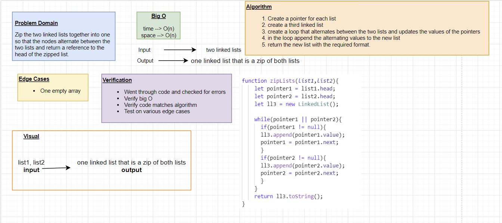

# Singly Linked List

Create a linked list with multiple methods and test them.

## Challenge

Node
Create a Node class that has properties for the value stored in the Node, and a pointer to the next Node.

Linked List
Create a Linked List class
Within your Linked List class, include a head property.
Upon instantiation, an empty Linked List should be created.

## API

**insert**
Arguments: value
Returns: nothing
Adds a new node with that value to the head of the list with an O(1) Time performance.

**includes**
Arguments: value
Returns: Boolean
Indicates whether that value exists as a Node’s value somewhere within the list.

**to string**
Arguments: none
Returns: a string representing all the values in the Linked List

**append**
arguments: new value
adds a new node with the given value to the end of the list

**insert before**
arguments: value, new value
adds a new node with the given new value immediately before the first node that has the value specified

**insert after**
arguments: value, new value
adds a new node with the given new value immediately after the first node that has the value specified

**kth from end**
argument: a number, k, as a parameter.
Return the node’s value that is k places from the tail of the linked list.
You have access to the Node class and all the properties on the Linked List class as well as the methods created in previous challenges.

**zip lists**
Arguments: 2 linked lists
Return: Linked List, zipped as noted below

## Whiteboard Process

