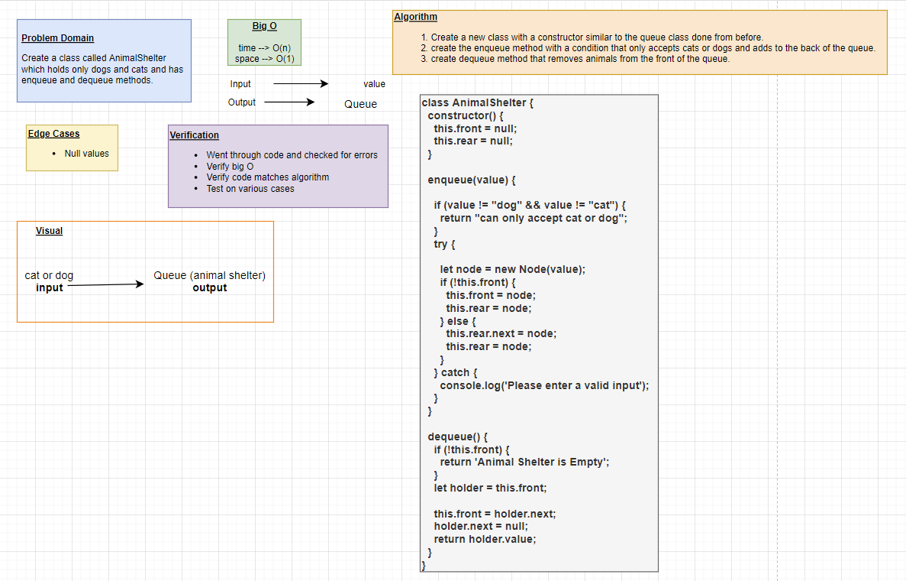

# Stacks and Queues

A **Stack** is a data structure that consists of Nodes. Each Node references the next Node in the stack, but does not reference its previous.

Common Terminology:

- Push
- Pop
- Top
- Peek
- isEmpty

Stack follows these concepts:

- FILO
- LIFO

A **Queue** is a collection of entities that are maintained in a sequence and can be modified by the addition of entities at one end of the sequence and the removal of entities from the other end of the sequence.

Common Terminology:

- Enqueue
- Dequeue
- Front
- Rear
- Peek
- isEmpty

Queue follows these concepts:

- FIFO
- LILO

## Challenge

Using a Linked List as the underlying data storage mechanism, implement both a Stack and a Queue

## API

### Stack

***Push*** - Nodes or items that are put into the stack are pushed

***Pop*** - Nodes or items that are removed from the stack are popped. When you attempt to pop an empty stack an exception will be raised.

***Top*** - This is the top of the stack.

***Peek*** - When you peek you will view the value of the top Node in the stack. When you attempt to peek an empty stack an exception will be raised.

***IsEmpty*** - returns true when stack is empty otherwise returns false.

### Queue

***Enqueue*** - Nodes or items that are added to the queue.

***Dequeue*** - Nodes or items that are removed from the queue. If called when the queue is empty an exception will be raised.

***Front*** - This is the front/first Node of the queue.

***Rear*** - This is the rear/last Node of the queue.

***Peek*** - When you peek you will view the value of the front Node in the queue. If called when the queue is empty an exception will be raised.

***IsEmpty*** - returns true when queue is empty otherwise returns false.

### Pseudo Queue

***Enqueue*** - Nodes or items that are added to the queue.

***Dequeue*** - Nodes or items that are removed from the queue. If called when the queue is empty an exception will be raised.

### Animal Shelter

***Enqueue*** - Nodes or items that are added to the queue.

***Dequeue*** - Nodes or items that are removed from the queue. If called when the queue is empty an exception will be raised.

## Whiteboard Process

