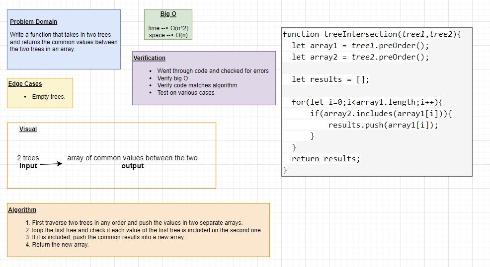

# Trees

Binary Tree and BST Implementation

## Challenge

### Node

Create a Node class that has properties for the value stored in the node, the left child node, and the right child node.

### Binary Tree

Create a Binary Tree class

Define a method for each of the depth first traversals:

- pre order

- in order

- post order which returns an array of the values, ordered appropriately.

- find max

Any exceptions or errors that come from your code should be semantic, capture-able errors. For example, rather than a default error thrown by your language, your code should raise/throw a custom, semantic error that describes what went wrong in calling the methods you wrote for this lab.

### Binary Search Tree

Create a Binary Search Tree class

This class should be a sub-class (or your languages equivalent) of the Binary Tree Class, with the following additional methods:

- ***Add***

Arguments: value

Return: nothing

Adds a new node with that value in the correct location in the binary search tree.

- ***Contains***

Argument: value

Returns: boolean indicating whether or not the value is in the tree at least once.

## API

- ***Add***

Arguments: value

Return: nothing

Adds a new node with that value in the correct location in the binary search tree.

- ***Contains***

Argument: value

Returns: boolean indicating whether or not the value is in the tree at least once.

- ***findMax***

Arguments: none

Returns: number

- ***Write a function called breadth first***

Arguments: tree

Return: list of all values in the tree, in the order they were encountered

- ***Write a function called fizz buzz tree***

Arguments: k-ary tree

Return: new k-ary tree

## Whiteboard Process

